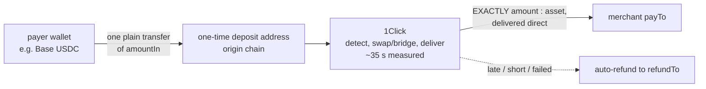
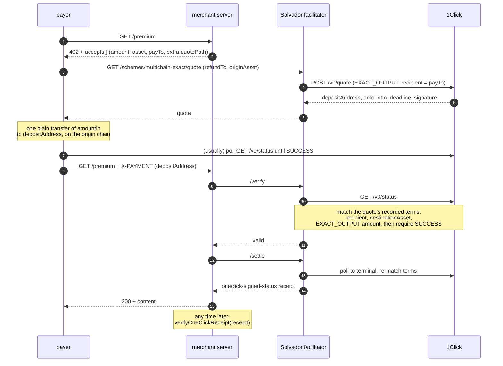
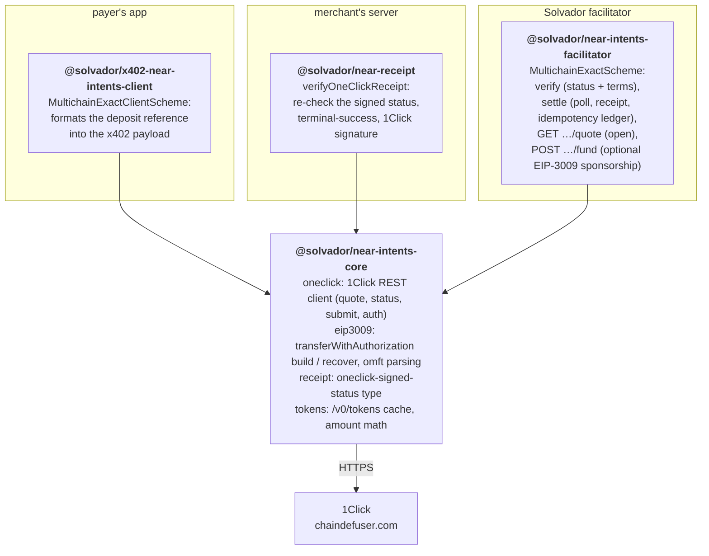
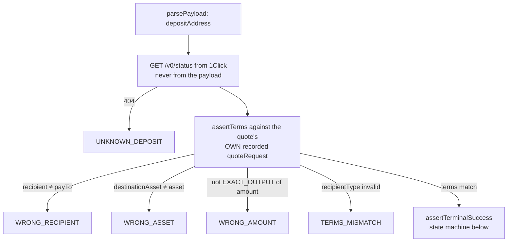
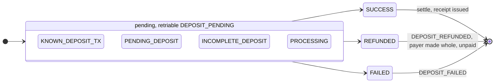

# `multichain-exact`: x402 send-to-pay over 1Click

An x402 payment scheme where the payment is nothing more than funding a 1Click EXACT_OUTPUT deposit address. The payer makes one plain transfer on whatever chain they already hold assets on; 1Click executes; the merchant receives exactly the advertised price, delivered directly to their own account. The x402 payload the payer presents is a single field, `{ depositAddress }`, and the facilitator verifies it not by trusting the payer but by re-fetching the execution status from 1Click and matching the quote's own recorded terms.

It runs inside Solvador, an x402 facilitator that operates verify/settle for merchants across several chains. The scheme is registered on `network: near:mainnet` and holds no chain keys at all: 1Click is the execution layer, the facilitator is a verifier with an idempotency ledger. (The monorepo also ships `near-intents-exact`, the balance-based signature scheme, and a flag-gated confidential path; this README covers `multichain-exact` only.)

Exercised live on mainnet: a $0.01 payment funded with Base USDC cost the payer about $0.010116 (about 1.2% route, of which 1Click's 0.2% keyless share disappears with a partner JWT) and delivered in about 35 seconds.

## Why this shape

Every other x402 scheme asks the payer's wallet to speak some standard: EIP-3009, NEP-141 transfers, a MultiPayload signature. This one asks for nothing. If a wallet can send a token, it can pay a 402. That makes the payer set effectively "anyone on any chain 1Click can source from", including exchange withdrawals and hardware wallets, with zero integration on the payer's side. The trade-offs are latency (a cross-chain execution, ~35 s, instead of a view-call verify) and asynchronous settlement (payment completes when 1Click delivers, not when the request arrives).

Three properties do the heavy lifting:

1. **EXACT_OUTPUT, delivered direct.** The quote fixes the merchant's receive amount, not the payer's send amount, and the `recipient` is the merchant's own account with `recipientType: DESTINATION_CHAIN`. No withdraw step, no facilitator custody, no held balance anywhere.
2. **The deposit address is a claim check.** A one-time address is bound by 1Click to one quote: one recipient, one asset, one amount, one refund address. Presenting it as payment can only ever prove that *that specific quote* executed.
3. **The refund path is 1Click's, not ours.** Late, short, or failed deposits refund automatically to the payer's `refundTo` on the origin chain. The facilitator never handles payer funds in any state.

## The flow

Money plane (one transfer, any wallet):



Control plane (x402), end to end:



The quote, the transfer, and the status poll are the payer application's business; the scheme does not care how the deposit came to exist. Presenting `{ depositAddress }` is the only x402-specific thing the payer does, and it is one JSON field. The payer may include `originTxHash` to let the facilitator nudge 1Click's deposit detection (`POST /v0/deposit/submit`), and `depositMemo` for MEMO-mode chains.

## Architecture



The split is deliberate:

- **`@solvador/near-intents-core`** holds every protocol primitive and nothing else: no HTTP framework, no wallet library, no Express. The same 1Click client and receipt types run in the browser paywall, the Node client, and the facilitator.
- **`@solvador/near-intents-facilitator`** implements `SchemeNetworkFacilitator` from `@x402/core`, Solvador's plugin interface, so registration is one `registerMultichainExact(...)` call and zero core changes. The quote and fund HTTP handlers are structurally typed (no Express import); an Express router satisfies them as-is. `getSigners()` returns `[]`: this scheme holds no keys. `getExtra()` advertises `quotePath` (and `fundPath` + `sponsored: true` when sponsorship is on) in `/supported`, which is how resource servers discover the endpoints.
- **`@solvador/x402-near-intents-client`** is intentionally thin here. Since there is nothing to sign, the plugin just accepts a deposit reference (or a callback that produces one from the requirements) and formats it into the payload. The quote/transfer/poll dance belongs to the application, which is where wallet UX lives anyway.
- **`@solvador/near-receipt`** lets the merchant re-verify the receipt forever without trusting the facilitator: terminal-success on the embedded status, and the 1Click signature against its published key when configured.

## verify() and settle(), precisely

Both paths funnel through the same three checks against a status fetched fresh from 1Click, never from the payload:



`verify()` runs the checks once and answers with `payer = quoteRequest.refundTo`. `settle()` first hits the deposit ledger: a settled address returns the cached receipt, a concurrently settling one is rejected, otherwise the entry is locked and the scheme polls to a terminal status (default 90 s timeout, 3 s interval, terms re-asserted on every poll; an `originTxHash` in the payload is forwarded to `/v0/deposit/submit` first to speed detection). On `SUCCESS` it builds the `oneclick-signed-status` receipt (the verbatim status response plus 1Click's signature, the deposit address, and the merchant's payment id when present), records it, and returns it with the settling transaction hash.

The status state machine, and what each state means to the scheme:



Errors carry the shared taxonomy with an explicit `retriable` flag, so client SDKs branch on codes, not strings. `DEPOSIT_PENDING` is the only common retriable one: the payer simply presented the payment before delivery finished.

## The quote endpoint

`GET /schemes/multichain-exact/quote?amount=…&asset=…&payTo=…&refundTo=…&originAsset=…[&deadlineSeconds=…]`

The facilitator requests a live (`dry: false`) quote: `swapType: EXACT_OUTPUT` for `amount`:`asset`, `recipient: payTo` on the destination chain, deposit and refund on the origin chain, default 1% slippage tolerance, deadline default 600 s (capped at 3600). The response passes through the deposit address, `amountIn` (raw and formatted), the deadline, 1Click's `timeEstimate`, and 1Click's signature over the quote, which the payer can keep as dispute proof. Merchants advertise the path via `extra.quotePath`; payers who prefer to talk to 1Click directly can, since the scheme only ever judges the deposit by its recorded terms.

## Gas-sponsored funding (optional)

With a `fundBroadcaster` configured, `POST /schemes/multichain-exact/fund` removes the payer's last cost: origin-chain gas. The payer signs an EIP-3009 `transferWithAuthorization` instead of sending a transfer, and the facilitator broadcasts it at its own expense. The scheme validates before spending gas:

- the deposit must exist at 1Click and still be in a fundable (pending) state;
- the origin asset must parse as a sponsorable omft ERC-20 (native coins cannot do EIP-3009);
- `authorization.to` must equal the deposit address and `value` must equal the quote's `amountIn`;
- the validity window must be open now and for at least another 60 s;
- for known token domains the signature is recovered locally and must match `from` (unknown domains skip this; the transaction itself reverts on a bad signature).

After broadcast, the tx hash is submitted to `/v0/deposit/submit` to accelerate detection. The broadcaster is injected by the host (Solvador wires its existing per-network viem clients), keeping this package EVM-library-free.

## Security model

The invariant: **nothing the payer sends is trusted; every judgment is made against 1Click's own record, fetched server-to-server.**

- A deposit that paid a different recipient, asset, or amount, or was quoted EXACT_INPUT, fails `assertTerms` and is unusable as payment here. The terms come out of the status response, which the payer cannot influence after the quote exists.
- Replay: the deposit address is the idempotency key. A repeat settle returns the cached receipt, never a second unlock. And because 1Click delivered directly to the merchant, there is no intermediate balance for a double-spend to target in the first place.
- `REFUNDED` and `FAILED` are unpaid: the resource is not delivered, and the receipt (still issued on the confidential-settlement variant of this path) documents the outcome for support. The payer's funds went back to `refundTo` automatically.
- The receipt is 1Click's signed status verbatim. The merchant re-verifies it independently with `verifyOneClickReceipt`, today structurally (terminal-success, matching deposit address) and against 1Click's published signing key when configured. Trust in the facilitator is not part of the merchant's security assumptions.

## Quick start

```bash
npm install          # workspaces: links the packages, installs deps
npm run typecheck    # tsc --noEmit across all packages
npm test             # 84 tests across the monorepo
npm run demo         # the live mainnet demo server (below)
```

Node >= 20.19 (developed on 22). ESM only, `node:test` + `tsx`, no build step: the packages export TypeScript source and both this monorepo and Solvador run via `tsx`.

Enabling it in Solvador is one flag, no relayer key:

| Env | Effect |
|---|---|
| `NEAR_INTENTS_MULTICHAIN=1` | Register + advertise `multichain-exact`, mount the quote (and fund) routes |
| `ONECLICK_JWT` | Optional partner JWT; removes 1Click's 0.2% fee |

Flags off, nothing changes: the scheme simply is not registered. A settlement writes an ordinary `transactions` row with `scheme = "multichain-exact"`, so billing, quota, and webhooks need nothing new. Sanity check:

```bash
curl -s localhost:4022/supported | jq '.kinds[] | select(.scheme=="multichain-exact")'
curl -s "localhost:4022/schemes/multichain-exact/quote?amount=10000&asset=nep141:17208628f84f5d6ad33f0da3bbbeb27ffcb398eac501a31bd6ad2011e36133a1&payTo=solvador.near&refundTo=0xYourAddress&originAsset=nep141:base-0x833589fcd6edb6e08f4c7c32d4f71b54bda02913.omft.near"
```

## Usage

Payer side (the plugin only formats; your app owns the quote/transfer/poll flow):

```ts
import { MultichainExactClientScheme } from "@solvador/x402-near-intents-client";

const scheme = new MultichainExactClientScheme(async (requirements) => {
  const quote = await requestQuote(requirements);   // your call to the quote endpoint
  await fundAndAwaitSuccess(quote);                 // one transfer + status poll
  return { depositAddress: quote.depositAddress, originTxHash };
});
const payload = await scheme.createPaymentPayload(2, requirements);
```

Facilitator side:

```ts
import { registerMultichainExact } from "@solvador/near-intents-facilitator";

const { quoteHandler, quotePath } = registerMultichainExact(baseFacilitator, {
  jwt: process.env.ONECLICK_JWT,      // optional
  network: "near:mainnet",
});
facilitatorRouter.get(quotePath, quoteHandler);   // GET /schemes/multichain-exact/quote
```

Merchant side:

```ts
import { verifyOneClickReceipt } from "@solvador/near-receipt";

const result = await verifyOneClickReceipt(receipt);
if (!result.valid) throw new Error(result.reason);
```

## The live demo

[`examples/near-intent-settlement`](examples/near-intent-settlement) is a complete merchant on mainnet: a 402-gated `GET /premium` with a browser paywall. Connect an EVM wallet, send one Base USDC transfer to the quoted deposit address, and about 35 seconds later `solvador.near` holds exactly the price in native NEAR USDC and the resource unlocks. A headless client (`npm run client -w @solvador/near-intent-settlement`) drives the same flow from the terminal, and `POST /api/verify-receipt` shows the merchant-side re-verification. Its README documents the measured costs and the paywall dev loop.

## Operational notes

- **No testnet exists for NEAR Intents**, so pre-production means dust-amount mainnet payments (the demo defaults to $0.01) plus dry quotes. Every integration check moves real money, deliberately in tiny amounts.
- **Quotes expire** (default deadline 10 minutes). A deposit that arrives late is refunded, not lost; pay soon after quoting.
- **The deposit ledger is in-memory by default.** A facilitator restart forgets settled deposit addresses, which weakens idempotency across restarts. Back it with a persistent store before real production traffic.
- [`docs/runbook.md`](docs/runbook.md) covers refunds and upstream failure modes; [`docs/integration.md`](docs/integration.md) covers facilitator wiring and bring-up; [`docs/wire-formats.md`](docs/wire-formats.md) documents the 1Click API surface used here, with sources.

## Further: private settlements

The same rails extend to confidential settlement. 1Click quotes accept a `confidentiality: basic | advanced` level, which keeps the amounts off the public record; the proof of payment then is not a public transaction but 1Click's signature over the execution status, which is exactly the `oneclick-signed-status` receipt shape this scheme already uses. Nothing about the merchant's verification story changes: `verifyOneClickReceipt` already carries the signature-check path.

That code is merged, tested, and flag-gated behind `SOLVADOR_NEAR_CONFIDENTIAL=1`. The only missing piece is partner-level confidentiality on the JWT; the moment that is available, a private x402 settlement is a config change away.
